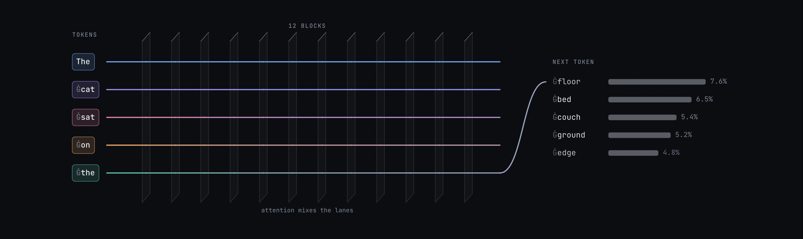
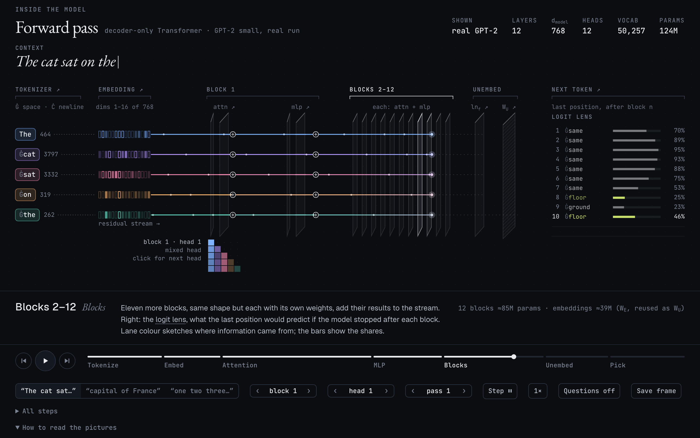
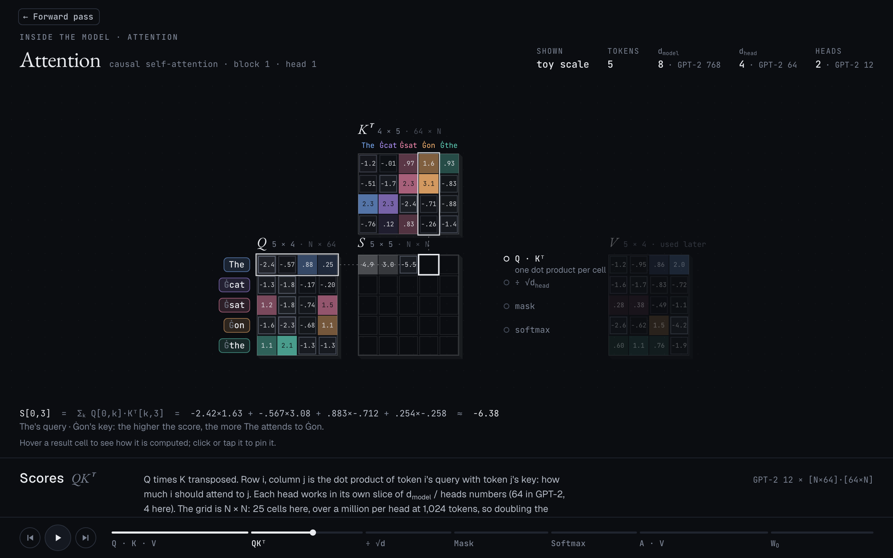
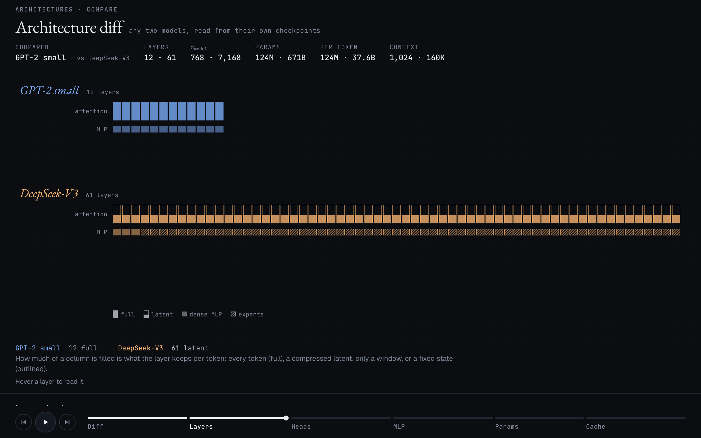
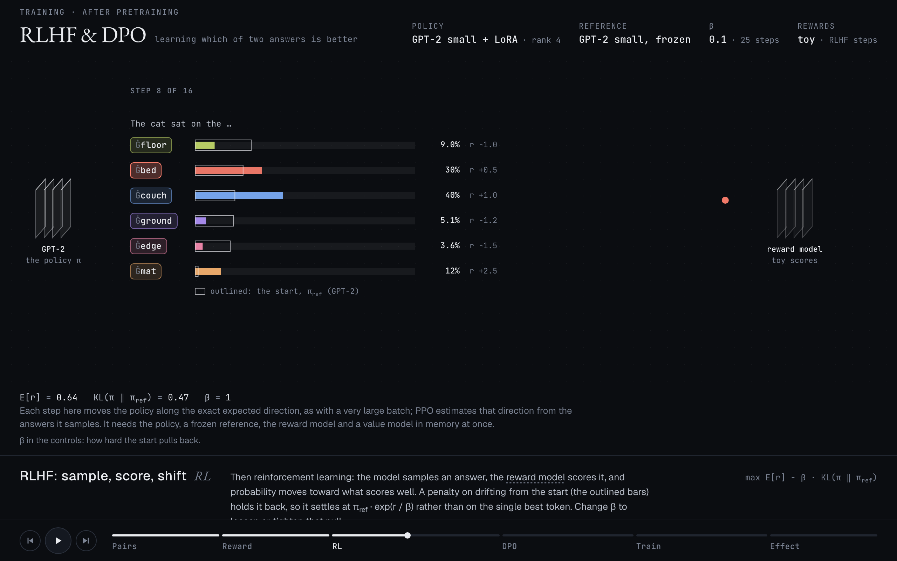
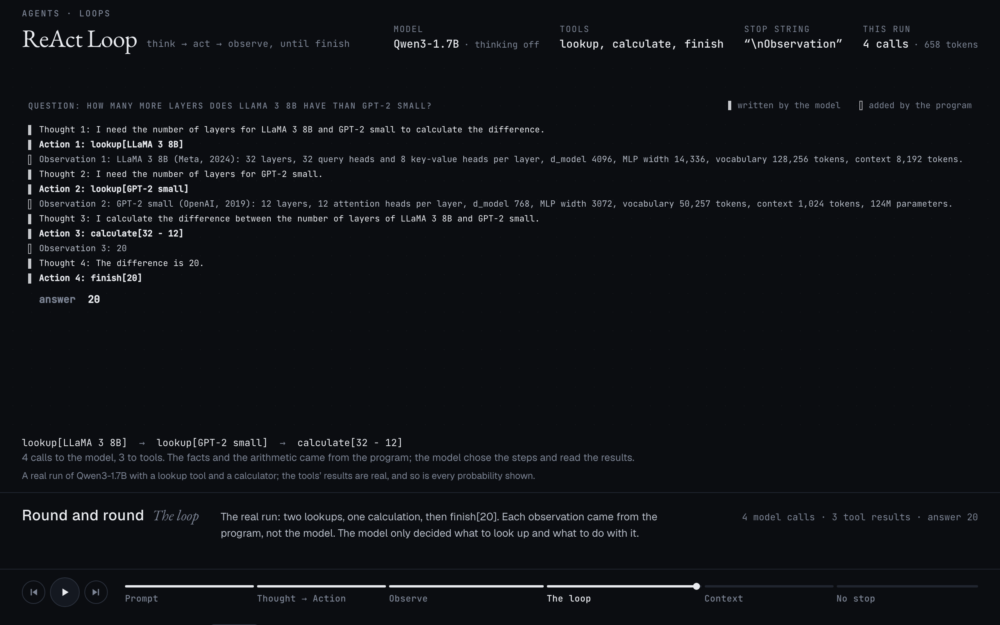
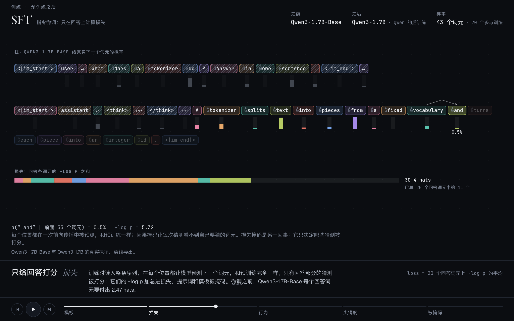

<h1 align="center">Token Trails</h1>

<p align="center"><b>Follow the tokens through AI systems.</b><br>
Animated, explorable pages that take a language model apart, token by token, with the numbers of real models.</p>

<p align="center"><a href="https://tokentrails.org"><b>▶ tokentrails.org</b></a> · English / 中文 · runs in the browser, nothing to install</p>

<p align="center"><a href="https://tokentrails.org"></a></p>

## What's inside

**37 pages in five parts**, each a short animation you can pause, scrub and step through:

| | |
| --- | --- |
| **Inside the model** | GPT-2 small taken apart: tokenizer, embedding, LayerNorm, attention, MLP, sampling. |
| **Training** | Next-token loss, backprop, optimizers, a tokenizer trained in the page, scaling laws, SFT, RLHF & DPO, LoRA. |
| **Architectures** | The 2017 Transformer, LLaMA, Mixtral, DeepSeek-V3, BERT, T5, ViT, CLIP, DiT and Mamba, each drawn as changes to GPT-2, and a diff of any two of 29 models. |
| **Serving** | KV cache, FlashAttention, PagedAttention, continuous batching, speculative decoding, quantization. |
| **Agents** | In-context learning, the ReAct loop, tool calling, RAG, multi-agent handoffs. |

<table>
  <tr>
    <td width="50%"><br><sub><b>Forward pass</b>: a real GPT-2 run, block by block</sub></td>
    <td width="50%"><br><sub><b>Attention</b>: every matrix product, cell by cell</sub></td>
  </tr>
  <tr>
    <td><br><sub><b>Architecture diff</b>: any two models, read from their checkpoints</sub></td>
    <td><br><sub><b>RLHF &amp; DPO</b>: the loop, computed in the page</sub></td>
  </tr>
  <tr>
    <td><br><sub><b>ReAct loop</b>: a real Qwen3-1.7B run with tools</sub></td>
    <td><br><sub><b>SFT</b>, in Chinese: only the answer is graded</sub></td>
  </tr>
</table>

## Real numbers, not made-up ones

The numbers come from real models run offline: GPT-2 (small to large), BERT, T5, ViT, CLIP, DiT, Mamba, distilgpt2, MiniLM and Qwen3-1.7B, plus the configs and checkpoint headers of 29 models from GPT-2 to 2025. The browser never runs a model; the scripts in [`scripts/`](scripts) export what each page draws. Where a picture needs arithmetic small enough to follow cell by cell, it uses a toy model and says so.

## Run it locally

```bash
npm install
npm run dev     # http://localhost:5173
npm run build   # typecheck, then a static build in dist/
```

Every push to `main` is built and deployed to [tokentrails.org](https://tokentrails.org) by [GitHub Actions](.github/workflows/deploy.yml). The site counts visits with [Cloudflare Web Analytics](https://www.cloudflare.com/web-analytics/), which sets no cookies and collects no personal data. How the code is organised, and how to add a page or regenerate the data, is in [CLAUDE.md](CLAUDE.md).

## License

Code under [MIT](LICENSE). The explanatory content (text, translations, drawings, logo) under [CC BY-NC 4.0](LICENSE-CONTENT.md): free to share and adapt for non-commercial use, with credit. Fonts and model-derived data keep their own licenses ([NOTICE.md](NOTICE.md)).

Made by **Zhehao Wu** · [zhehao075@gmail.com](mailto:zhehao075@gmail.com)
